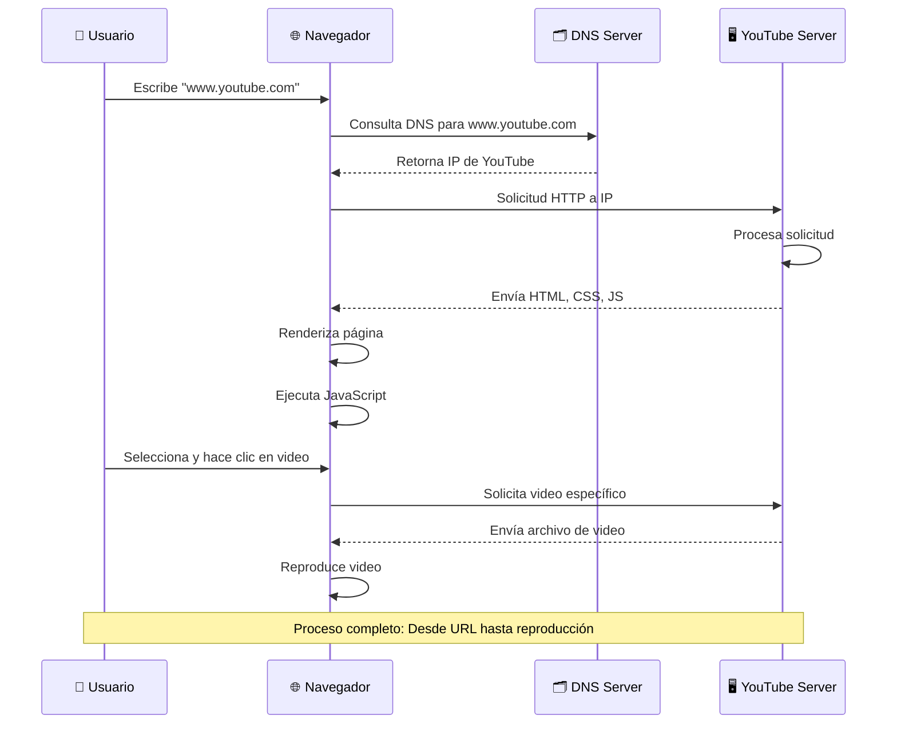

## Diagrama de Secuencia

```mermaid
sequenceDiagram
    participant U as 👤 Usuario
    participant N as 🌐 Navegador
    participant DNS as 🗂️ DNS Server
    participant YT as 🖥️ YouTube Server
    
    U->>N: Escribe "www.youtube.com"
    N->>DNS: Consulta DNS para www.youtube.com
    DNS-->>N: Retorna IP de YouTube
    
    N->>YT: Solicitud HTTP a IP
    YT->>YT: Procesa solicitud
    YT-->>N: Envía HTML, CSS, JS
    
    N->>N: Renderiza página
    N->>N: Ejecuta JavaScript
    
    U->>N: Selecciona y hace clic en video
    N->>YT: Solicita video específico
    YT-->>N: Envía archivo de video
    N->>N: Reproduce video
    
    Note over U,YT: Proceso completo: Desde URL hasta reproducción
```